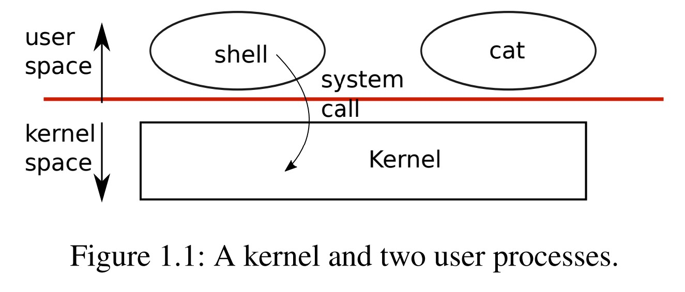
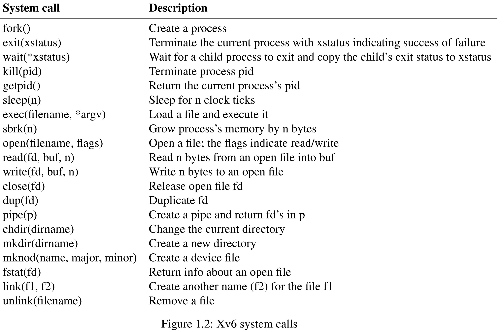
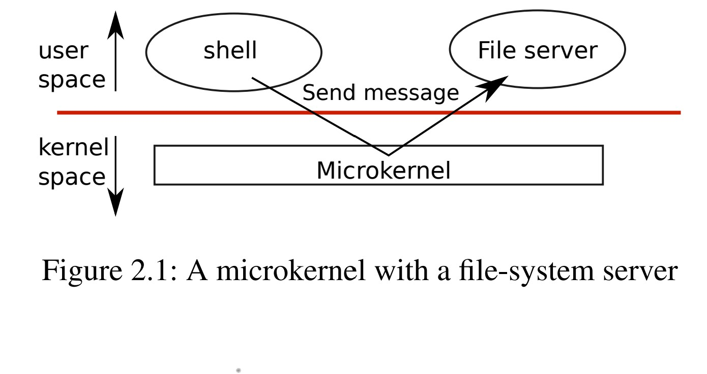
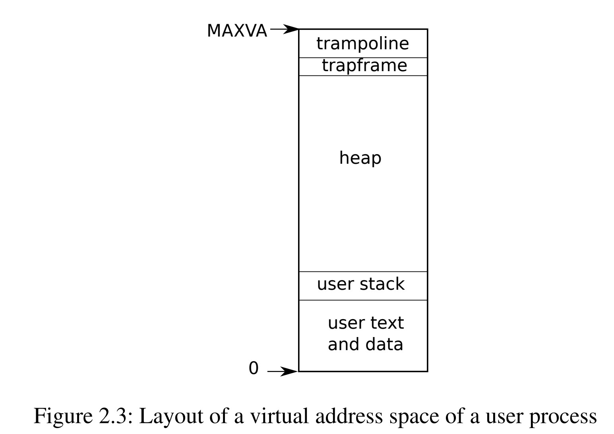

# xv6:一个简单的类Unix教学用操作系统

原作 Russ Cox, Frans Kaashock, Robert Morris
原作链接 [xv6: a simple, Unix-like teaching operating system](https://pdos.csail.mit.edu/6.828/2019/xv6/book-riscv-rev0.pdf)

[toc]

## 译者前言

本系统使用c语言编写，在阅读本书前应该有c语言基础。在学习xv6之前，应该对操作系统的作用有一定的了解，有Linux的使用经验，有Linux系统编程的相关知识作为基础，能够更好的理解书中的内容。
考虑到读者C语言基础参差不齐，这里译者补充一些C语言知识
###### 1.`main`函数的参数。
有命令行使用经验的读者应该会发现，在命令行里输入命令往往携带一定的参数。命令行的命令本质上就是一个应用程序，那么外界的参数是如何加入应用程序呢？利用的机制就是`main`函数的参数，携带参数的`main`函数往往写作如下形式
```c
int main(int argc,char* argv[])
```
`argc`是参数的总个数，`argv`是每个参数的起始地址。为什么`argv`被认为是`char`的指针数组呢？因为我们并不能确定输入进函数的究竟都有那些形式的，所以我们把每个参数都看作是比特数组，而一个`char`大小整好是一个比特，故而用`char`的指针指明一个参数的位置。接下来我们举个例子来说明这些参数是如何使用的。译者给出的所有代码都是在WSL上运行的，因为WSL有方便的Linux shell，而windows的cmd译者用不习惯。
```c
#include<stdio.h>

int main(int argc,char* argv[]){
    for(int i=0;i<argc;++i){
        printf("%d:%s\n",i,argv[i]);
    }
    return 0;
}
```
使用gcc编译`gcc main.c -o main`,得到可执行文件main，在shell输入命令`./main Hello World`，可以得到结果如下
```
0:./main
1:Hello
2:World
```
由此可见，通过`main`函数的参数，命令行成功给应用程序传递了数据。

## 前言与致谢

暂时略过

## 第一章 操作系统的接口 Operating system interfaces 

操作系统的工作是让多个应用程序共享同一台电脑，提供一系列方便的服务从而让用户程序不必直接和硬件交互。操作系统管理并抽象低层次的硬件，因此用户程序就不必关注硬件，比如打印程序就不需要知道它自己究竟在是用什么样的打印机。它也让不同程序可以共享硬件，这样一来它们就可以同时运行。最后，操作系统提供了可以控制的进程交互方法，从而让他们可以共享数据或者合作工作。

一个操作系统通过接口向用户进程提供服务。设计一个优秀的接口是非常困难的。一方面，我们希望接口简单并且功能被严格限制，因为这样一来容易实现。另一方面，我们可能倾向于为应用程序提供各种特性。解决这种矛盾的诀窍是设计依赖于少数机制的接口，这些机制可以组合起来提供更多的通用性。

本书使用一个操作系统作为例子来说明操纵系统这一概念。xv6操作系统提供了基本的接口。这些接口由Ken Thompson和Dennis Ritchie的Unix操作系统[10]引入，xv6还模仿了Unix的内部结构。Unix提供了有限的接口，但是接口的功能结合的很好，提供了惊人的通用性。这些接口非常成功以至于很多现代操作系统——BSD、Linux、Mac OS X、Solaris、以及Microsoft Windows——都在使用类Unix接口。理解xv6对于理解这些操作系统来说是一个好的开始。

内核是为其他运行的程序提供服务的一个特殊程序。就像在图1.1中展示的一样，xv6采用传统的内核形式。运行的程序被称为进程，每一个进程都有自己的内存空间，里面包含指令，数据和一个栈。这些指令实现了程序的运算。数据是运算用到的变量。栈储存了程序函数调用序列。

当一个进程需要用到内核服务时，它会调用操作系统的接口。这样一个过程被称作系统调用。系统调用进入内核；内核完成服务并返回。这样一来，进程就可以在内核空间（kernel space）和用户空间（user space）之间切换

内核使用CPU的保护机制来确保每个用户态进程能且仅能操作自己的内存。内核拥有多种硬件权限，运行起来需要实现一定的保护措施，用户程序就没有这些权限。当应用程序调用一个系统调用，硬件就会提升权限级别并且运行一个内核中的预处理函数



内核提供的系统调用就是我们应用程序看到的系统接口。xv6内核提供了Unix内核提供的服务和系统调用的一个子集。图1.2列出了xv6的全部系统调用。



本章的其余部分概述了xv6的服务进程、内存、文件描述符、管道和文件系统，讨论了代码片段和shell(传统类unix系统的主要用户界面)如何使用它们。shell对系统调用的使用说明了它们精巧的设计思路。

shell是一个普通的程序，它从用户那里读取命令并执行它们。事实上，shell是一个用户程序，而不是内核的一部分，这说明了系统接口所具有的强大功能：shell没有什么特别之处。这也意味着shell容易更换;因此，现代Unix系统有多种shell可供选择，每种shell都有自己的用户接口和脚本。xv6shell是一个Unix Bourne shell的简单实现。它的实现可以在(user/sh.c:1)找到。

### 1.1 进程和内存 Processes and memory

xv6进程由用户空间内存(指令、数据和堆栈)和内核才能查看和修改的进程状态组成。Xv6可以让多个进程分时运行：在等待执行的一组进程中，操作系统透明地切换可用的cpu。当进程不执行时，xv6会保存CPU寄存器，并在下次运行进程时恢复它们。内核将一个唯一的进程标识符（又称pid）和一个进程关联起来。

进程可以使用系统调用`fork`创建一个新进程。`fork`创建的新进程被称为子进程，它的内存中储存的内容与父进程完全相同。`fork`同时返回父进程和子进程。在父进程中，`fork`返回子进程pid;在子进程中，它返回0。例如，考虑以下程序片段[5]

```c
int pid = fork();
if(pid > 0){
    printf("parent: child=%d\en", pid);
    pid = wait(0);
    printf("child %d is done\en", pid);
} else if(pid == 0){
    printf("child: exiting\en");
    exit(0);
} else {
    printf("fork error\en");
}
```

系统调用`exit`让调用进程停止执行并释放内存和打开文件等资源。`exit`接受一个整数状态参数，通常为0表示成功1表示失败。系统调用`wait`返回当前已退出的子进程的pid并复制子进程的退出状态到`wait`的参数所指明的地址;如果调用者的子进程没有退出的，`wait`等待子进程退出。如果父节点不关心子节点的退出状态，它可以传递一个0地址给`wait`。

上面代码的输出是

```c
parent: child=1234
child: exiting
```

在这个例子中，输出可以按任意一种顺序出现，这取决于父进程还是子进程首先调用`printf`。子进程退出后，父进程的等待返回，导致父进程进行打印`parent: child 1234 is done`

虽然子进程和父进程最初的内存内容相同，但是父进程和子进程使用不同的内存和寄存器:在一个进程中改变一个变量不会影响到另一个进程。例如，当wait的返回值被存储在父进程的pid中，它不会改变子进程的pid变量。子进程中的pid值仍然为零。

系统调用`exec`将存储在文件系统中的文件加载为新内存映像来替换原本的内存。这个文件必须有一个特定的格式。这一格式指定文件的哪一部分保存指令，哪一部分是数据，哪一部分是指令入口等等。xv6使用的是ELF格式，第3章会详细讨论。当执行成功时，它不会返回调用程序;相反，新加载的指令从ELF头中声明的入口点开始执行。`exec`接受两个参数:包含可执行文件的文件名和一个字符串参数数组。例如

```c
char *argv[3];
argv[0] = "echo";
argv[1] = "hello";
argv[2] = 0;
exec("/bin/echo", argv);
printf("exec error\en");
```

这个片段将调用程序替换为程序/bin/echo的实例，并在运行时输入参数`echo hello`。大多数程序都会忽略第一个参数，它通常是程序的名称。

xv6 shell使用上面的调用来代表用户运行程序。shell主体结构简单;先看`main`(user/sh.c: 145)。主循环用`getcmd`从用户读取一行输入。然后调用`fork`, `fork`会创建一个shell进程的子进程。父进程调用`wait`，同时子进程运行命令。举个例子，如果用户向shell输入了`echo hello`, `runcmd`就会被调用，参数将设置为`echo hello`。`runcmd` (user/sh.c:58)运行实际的命令。对于`echo hello`，`runcmd`将调用`exec` (user/sh.c:78)。如果`exec`成功，子进程将执行来自`echo`而不是`runcmd`的指令。在某些时候，`echo`将调用`exit`，这使得父进程从`main`中的`wait`返回(user/sh.c:145)。

你可能想会问为什么`fork`和`exec`不合并在一个调用中。后面将会解释这一点。在shell中创建进程和加载程序的单独调用对I/O重定向有很大便利。为了避免创建一个浪费时间复制进程然后立即替换它，操作系统内核通过使用虚拟内存技术(如写时拷贝)来优化`fork`实现。

Xv6隐式分配大多数用户空间内存:`fork`分配子进程拷贝父进程内存所需的内存，`exec`分配足够的内存来保存可执行文件。一个在运行时需要更多内存的进程(比如`malloc`)可以调用`sbrk(n)`来增加n个字节的数据内存;`sbrk`返回新内存的位置。

Xv6没有提供用户的概念，也没有保护一个用户不受另一个用户操作的影响;在Unix语境下，所有xv6进程都以root用户身份运行。

### 1.2 I/O和文件描述符

文件描述符（file descriptor）是一个表示内核管理对象的整数，进程可以对该对象进行读写。进程可以通过以下方式获取文件描述符
1. 打开文件、文件夹、设备
2. 创建管道
3. 复制现有的描述符

为了简单起见，我们通常将文件描述符所指的对象称为文件;文件描述符接口通过抽象消除了文件、管道和设备之间的差异，使它们看起来都像字节流。

在内核内部，xv6内核为每个进程使用独立的文件描述符，这样每个进程都有一个从0开始的私有空间用来储存文件描述符。按照惯例，进程从文件描述符0(标准输入)读取数据，将输出写入文件描述符1(标准输出)，并将错误消息写入文件描述符2(标准错误)。正如我们将看到的，shell利用上述约定来实现I/O重定向和管道。shell确保始终有三个打开的文件描述符(user/sh.c:151)，它们是控制台（console）的默认文件描述符。

系统调用`read`和`write`通过文件描述符来对打开的文件进行读取字节和写入字节。调用`read(fd, buf, n)`最多从文件描述符`fd`读取`n`个字节，将它们复制到`buf`中，并返回所读取的字节数。每个引用文件的文件描述符都有一个与之关联的偏移量(offset)。`read`从当前文件的偏移量中读取数据，然后将该偏移量向前移动读取的字节数:后续的`read`将返回第一次读取返回的字节数之后的字节数。当没有更多的字节可读时，read返回0以表示文件的结束。

调用`write(fd, buf, n)`将从`buf`写入`n`个字节到文件描述符`fd`，并返回写入的字节数。只有发生错误时，`write`才写入小于`n`字节的数据。和`read`一样，`write`是在当前文件的偏移量处写数据，然后将该偏移量向前移动所写的字节数:每次`write`都会从前一次`write`结束的地方开始

下面的程序片段(程序`cat`的主要逻辑)将数据从标准输入复制到标准输出。如果发生错误，它将向标准错误写入一条消息。

```c
char buf[512];
int n;
for(;;){
    n = read(0, buf, sizeof buf);
    if(n == 0)
        break;
    if(n < 0){
        fprintf(2, "read error\en");
        exit();
    }
    if(write(1, buf, n) != n){
        fprintf(2, "write error\en");
    exit();
    }
}
```

在代码片段中，需要注意的重要一点是，`cat`不知道它是从文件、控制台还是管道中读取的输入数据。类似地，`cat`不知道它是打印到控制台、文件还是其他什么。`cat`的实现让文件描述符0为输入，文件描述符1为输出，不考虑0，1这两个文件描述符究竟指向什么。

系统调用`close`释放一个文件描述符，使其可以被`open`、`pipe`或`dup`系统调用重用(见后文)。新分配的文件描述符总是当前进程中编号最小的未使用描述符。

文件描述符和`fork`相互配合实现了I/O重定向。`fork`复制父进程的文件描述符表及其内存，因此子进程开始时打开的文件与父进程完全相同。系统调用`exec`替换调用进程的内存，但保留其文件表。这种行为允许shell通过`fork`、重新打开选择的文件描述符，然后执行新程序来实现I/O重定向。下面是shell为命令`cat < input.txt`运行的简化代码:

```
char *argv[2];
argv[0] = "cat";
argv[1] = 0;
if(fork() == 0) {
    close(0);
    open("input.txt", O_RDONLY);
    exec("cat", argv);
}
```

在子进程关闭文件描述符0之后，`open`保证将该文件描述符用于新打开的input.txt: 0将是最小的可用文件描述符。然后`cat`使用引用了input.txt的文件描述符0(标准输入)。

​在xv6的shell中，重定向I/O的代码按照下面描述的方式运行。回想一下，当我们在shell调用一个命令时，shell的代码已经用fork函数新建了一个和shell相同的子进程，而runcmd函数将会调用exec来加载一个新的新程序。由此观之，我们就可以解释为什么我们要将fork和exec分为两个调用了。因为，在将fork和exec分开的情况下，系统允许shell在它创造的子进程中使用open，close，dup等系统调用来改变标准输入输出文件描述符代表的文件，然后再进行exec。不需要改变子程序中的任何一个代码就能够实现I/O重定向。

​尽管fork复制了文件描述符表，但是每个文件的输入输出偏移依旧被父子进程共享，举个例子：

```c
if(fork() == 0){
    write(1,"hello ",6);
    exit(0);
} else {
    wait(0);
    write(1,"world\n",6);
}
```

我们来看这段代码，在父进程中调用了`wait(0)`，这使得父进程会在子进程结束后再运行，其结果是文件描述符1所对应的文件将会包含数据`hello world`。父进程中的`write`函数输入的内容紧跟着子进程中的`write`函数输入的内容。这一行为使得有序的shell命令能够再文件中输出有序的字符串，比如`(echo hello;echo world) > output.txt`

系统调用dup返回一个新的文件描述符，这个文件描述符所代表的I/O对象和作为dup参数的文件描述符所代表的I/O对象是同一个。这两个文件描述符共享同一个文件输入输出的偏移，就像fork在父子进程中产生的文件描述符一样。这种特性为我们提供了另一种向文件写入hello world的方法

```c
fd = dup(1);
write(1,"hello ",6);
write(fd,"world\n",6);
```

如果两个文件描述符是通过一系列的fork和dup从同一个文件上派生出来的，那么他们共享同一个偏移。另一方面，即使使用open打开同一个文件两次，产生的两个文件描述符彼此的偏移也是相互独立的。dup的存在允许下列命令

```bash
ls 存在的文件 任意不存在的文件 > tmp1 2>&1
```

命令`2>&1`告诉shell，在这个指令中，文件描述符2是文件描述符1的复制。存在的文件的文件名和不存在的文件导致的错误信息将会被输出到tmp1中。xv6的shell不支持错误信息文件描述符的重定向，但是现在你知道如何去实现它了。

文件描述符是一个有力的抽象工具，因为它隐藏了下列信息：一个写入进程向文件描述符1写入数据时，可能在对文件写入，可能在对设备（比如console）写入，也可能在对管道写入。

### 1.3 管道 Pipes

一个管道是一个小型的内核态的缓冲区，进程可以通过文件描述符向它写入数据或者读取数据。通常一个管道由两个进程分别持有它的一个文件描述符，这两个进程一个负责写入数据，一个负责读取数据。管道提供了进程通信的方法。

下面的代码可以运行程序`wc`，有一个管道的输出端将会作为该进程的标准输入

```c
int p[2];
char *argv[2];
argv[0] = "wc";
argv[1] = 0;
pipe(p);
if(fork() == 0){
    close(0);
    dup(p[0]);
    close(p[0]);
    close(p[1]);
    exec("/bin/wc",argv);
} else {
    close(p[0]);
    write(p[1],"hello world\n",12);
    close(p[1]);
}
```

`pipe`函数可以创造一个管道，并且将读取和写入文件描述符放入数组p中。程序调用`fork`后，父子进程都有了管道的文件描述符。子进程将管道的读取端`p[0]`复制到文件描述符`0`上，关闭了p中的文件描述符并且运行`wc`。当`wc`通过标准输入读取数据时，它实际上是在从管道中读取数据。父进程关闭了管道的读取端，向管道中写入数据，然后关闭了管道的写入端。

在用`read`读取管道时，如果没有数据可用，那么它将会等待写入端写入数据或者管道的所有写入端被关闭。在后一种情况下，`read`将会返回0，这和读取到文件末尾时的反应是一样的。由于`read`会阻塞进程直到可以返回为止，所以在子进程中先关闭管道的输入端再运行`wc`程序这一顺序是十分重要的。如果在运行`wc`的时候，子进程仍然持有管道的输入端，那么`read`将永远不能等到管道末尾。

xv6的shell实现管道的代码在文件sh.c的100行。我们在shell中使用一个管道，往往是使用如下格式

```bash
程序1 | 程序2
```

在shell，当实现管道命令时，父进程会先创建管道，然后创建一个子进程1。子进程1先将管道的输入端和程序1的输出端连接起来，然后关闭其他文件描述符，运行程序1。接着，父进程会创建子进程2，子进程2先将管道的输出端和程序2的输入端连接起来，然后运行程序2。最终该命令将会创造3个进程，并构成一个进程树。进程树的两侧是分别运行程序1程序2的子进程，中间的连接进程等待两个子进程结束。理论上，你可以让中间进程来运行管道的左端，但是这样做会使实现更加复杂。

管道看上去和临时文件功能相同。下列命令

```bash
echo hello world | wc
```

也可以用临时文件来实现

```bash
echo hello world > /tmp/xyz; wc < /tmp/xyz
```

但是，管道至少有4个优势是临时文件所不具备的。

- 首先，管道在使用完毕后，会自动清理自己，而如果使用中间文件，程序在结束后必须小心删除`/tmp/xyz`。
- 第二，管道可以传输任意长度的数据，而临时文件必须要在磁盘上由足够的空间储存所有数据。
- 第三，管道运行两侧的程序并行运行，而临时文件必须首先运行第一个程序，待第一个程序结束后，才能运行第二个。
- 第四，如果你在实现进程间通信，管道读写远比使用临时文件更有效率

### 1.4 文件系统 File System

xv6的文件系统提供两种文件，第一种是包含任意比特数组的数据文件（data file），另一种是文件夹，它包含其他数据文件和文件夹（directory）。文件夹形成了一棵树，它的根是一个特殊的文件夹root。以`/a/b/c`为例，这段文件路径指明有一个文件名为c，它在名为b的文件夹中，而文件夹b在名为a的文件夹中，文件夹a在根文件夹`/`中。像这样以`/`开头的路径称之为绝对路径，还有一种路径不以`/`开头，被称为相对路径，它的根文件是从当前所在文件夹（又称工作目录）算起的。当前所在文件夹可以用系统调用`chdir`改变，接下来的两段代码打开了相同的文件：

```bash
chdir("/a")
chdir("b")
open("c",O_RDONLY);
```
```bash
open("/a/b/c",O_RDONLY);
```

第一段代码将当前所在文件位置改成了`/a/b`，第二段代码没有改变当前所在文件位置。

有很多系统调用可以用来创建一个新的文件或者文件夹：

- `mkdir`创建一个新的文件夹
- `open`加上`O_CREATE`标志创建一个新的数据文件
- `mknod`创建一个新的设备文件（在xv6中，设备被视为一个文件，向设备读写数据和向文件读写数据的接口是一样的，译者注）

接下来这个例子展示了上面三个系统调用的用法

```c
mkdir("/dir");
fd = open("/dir/file",O_CREATE|O_WRONLY);
close(fd);
mknod("/console", 1, 1);
```

`mknod`在文件系统中创建了一个文件，但是这个文件是空的。同时，这个文件的元数据（用于描述数据的数据称为元数据，这里是说操作系统中用来记录这个文件属性的数据，译者注）把文件标记为设备文件，并且记录了主设备号和副设备号（就是`mknod`中的两个参数）。主设备号和副设备号唯一标识出一个内核记录中的设备。当一个进程打开这个文件的时候，内核将`read`、`write`这两个系统调用转交给内核中的设备管理而不是文件系统。

系统调用`fstat`可以找到文件描述符相关对象的信息。它们被保存在结构体stat中，而stat定义在stat.h文件中

```c
#define T_DIR 1 // 文件夹
#define T_FILE 2 // 文件
#define T_DEVICE 3 // 设备
struct stat {
	int dev; // 文件系统的磁盘设备
	uint ino; // Inode号
	short type; // 文件类型
	short nlink; // 文件链接数量
	uint64 size; // 文件大小
};
```

一个文件的名字和文件本身并不相同，真正代表文件本身的是inode，一个inode可以有多个名字，我们称之为链接（*links*），系统调用`link`给一个inode创造另一个在文件系统中的名字。接下来的代码创造了一个新文件，它有a，b两个名字：

```c
open("a", O_CREATE|O_WRONLY);
link("a", "b");
```

对a读写和对b读写是一样的。每一个inode有一个独一无二的inode号(*inode number*)。运行上面的代码后，我们可以使用`fstat`检查a，b对应的实际文件，我们会发现，这两个文件名对应的`stat`有着相同的`ino`，并且`nlink`都为2

系统调用`unlink`从文件系统中删除一个文件名。只有`nlink`归零并且没有任何文件描述符与该文件相关联时，文件inode和文件实际占用磁盘空间才会被真正删除，所以如果添加代码

```c
unlink("a");
```

将会保留b和文件inode。除此之外，

```c
fd = open("/tmp/xyz", O_CREATE|O_RDWR);
unlink("/tmp/xyz");
```

常常用于创造一个关闭文件或退出进程之后就立即删除的临时文件。

对文件系统进行操作的shell指令常常是用户态程序，比如`mkdir ln rm`等等。这一设计允许任意用户添加新的用户程序从而扩展shell的功能。回过头来看，这一设计非常自然，但是和Unix同时代的其他操作系统常常将这些命令内建在shell中，然后将shell运行在内核态中。

一个例外是`cd`，它被内建在shell中。这样做的原因是，`cd`需要改变shell自身的当前文件目录。如果`cd`和普通指令一样运行，那么shell会新建一个子进程并在子进程中运行`cd`，这样一来，`cd`就只能改变子进程的当前文件目录了。shell本身的工作目录并未改变。

### 1.5 真正的操作系统 Real World

该节与xv6无关，主要简述了Unix的优势以及对其他操作系统的影响，故暂时略去，译者注

### 1.6 练习 Exercises

 暂时略去，译者注。

## 第二章 操作系统的组织结构

操作系统的一个关键需求就是同时支持多个活动。举个例子，使用在第一章里出现过的系统调用`fork`可以创建一个新的进程。除此之外，操作系统必须在这些进程之间分时共享计算机的资源，比如说，尽管计算机中的进程比计算机的CPU还要多，操作系统必须保证所有进程都有所推进。同时操作系统也要保持进程之间的独立性。如果一个进程出现了错误或中断，它不应该影响到那些和它无关的进程。但是完全隔离进程也不符合需求，因为有时，比如使用管道的时候，我们需要进程之间相互沟通。因此一个操作系统必须满足三个需要，并发，独立，可交互

这一章节简述了操作系统是通过什么样的组织结构来实现这三个需求的。事实上，有很多方法可以做到这一点，但是本文主要关注由Unix操作系统提出的宏内核主流设计。这一章也简述了xv6中的进程，它是xv6中独立性的基本单位。xv6在启动时创造第一个进程。

xv6运行在多核RISC-V微处理器上，并且它的很多底层功能（比如他的进程实现）是针对RISC-V实现的。RISC-V是一个64位的CPU，xv6也是用LP64C语言（L指long，P指指针，LP64C的意思是long和指针是64位的，int是32位的C语言）实现的。本书假设读者已经有了一点在某些体系结构上使用机器级编程的经验，与xv6相关的RISC-V特性，将会到使用的时候再进行介绍。在这里推荐一本RISC-V参考书《The RISC-V Reader: An Open Architecture Atlas》[9]。用户级ISA[2]和特权架构[1]可参考官方规范。

本文的CPU（即中央处理器）指执行计算的硬件单元。其他文件（比如RISC-V规范）也使用处理器，核，核心等词汇来代指CPU。xv6使用的多核RISC-V硬件指的是有多个CPU共享同一个内存，能够并行多个程序的芯片。本文有时使用多重处理器作为多核的同义词，尽管多重处理器有时也用来指由多个不同芯片的计算机主板。

在完整电脑上的CPU周围有大量支持硬件，绝大多数多是I/O接口。我们可以用`qemu`的`-machine virt`命令模拟出xv6运行的硬件环境。它包括RAM，带有启动代码的ROM，硬盘，用户键盘和屏幕的串口。

### 2.1 硬件资源抽象 Abstracting physical resources

在讲解操作系统时首先要说明的问题是，为什么要有操作系统？也就是说，即使没有操作系统，我们同样可以用程序库的方式实现图1.2中的系统调用，然后让应用程序和它们链接。如果这样做，那么每个应用程序都能有为他们自己量身定做的程序库。应用程序可以直接和硬件资源交互并且以最佳方式使用这些资源（为了更好的性能）。事实上，一些嵌入式操作系统和实时系统都是这样做的。

使用程序库的缺点如下：如果系统中有一个以上的应用程序正在运行，那么这些应用程序必须行为良好。举个例子，每个应用程序必须每过一段时间就主动放弃CPU从而让其他应用程序可以运行。在所有应用程序都相互信任且无bug的情况下，这样一种合作式的时间安排是合理的。但是更常见的情况是，应用程序之间并不能相互信任并且不出bug，所以我们都想要与合作方案相比，程序之间更具有独立性的方案。

为了得到更高的独立性，我们最好放弃让应用程序直接解除敏感的硬件资源，转而选择将硬件资源抽象成一种服务。举个例子，应用程序仅仅通过`open,read,write,close`这几个系统调用来和文件系统打交道，从不会直接读写磁盘块。这为应用程序提供了使用路径名的便利，并且它允许操作系统管理磁盘。

类似的，Unix可以在进程之间切换硬件CPU，在必要的时候保存和回复储存器状态，这些行为对应用程序都是透明的。因此应用程序不用考虑时间共享。这种透明性允许操作系统共享CPU，即使应用程序在无限循环也是一样。

另一个例子是，Unix进程使用`exec`去建立内存映射而不是直接和物理内存进行交互。这允许操作系统去决定将一个进程放在内存的什么位置。如果内存不足，操作系统可能将一部分进程储存在磁盘上。`exec`也向用户提供了便利的文件系统来储存可执行文件。

在Unix中，很多形式的进程间通讯通过文件描述符实现。不仅仅是因为文件描述符通过抽象消除了很多细节（比如使用管道时数据储存在哪里），还是因为他们定义了一种简化进程间通信的方式。举个例子，如果管道一端的进程出错了，内核将生成一个文件结束符（EOF）给另一端的进程。

如你所知，在图1.2中的系统调用既能够给程序员提供足够的便利，又能够提供尽可能高的独立性。Unix接口不是硬件资源抽象化的唯一方法，但是它已经被证明是一个优秀的选择。

### 2.2 用户模式，内核模型，系统调用 User mode, supervisor mode, and system calls

强隔离性需要应用程序和操作系统之间有很强的独立性。如果应用程序犯了错误，我们不会希望操作系统或者其他应用程序受到影响。同时，操作系统应该有能力清理掉出错的应用程序并且继续运行其他的应用程序。为了获得足够强的独立性，操作系统必须禁止应用程序修改（甚至是读取）操作系统的数据结构和指令，禁止应用程序解除其他应用的内存。

CPU为独立性提供了硬件支持。举个例子，RISC-V可以在三种模式下运行指令：机器模式（machine mode），内核模式（supervisor mode），用户模式（user mode）。机器模式下运行的指令有全部的权限。CPU都是从机器模式启动的。机器模式更多的是为了初始化一台电脑。xv6在机器模式下运行部分指令，然后切换到内核模式继续运行。

内核模式下，CPU可以运行特权指令：比如说，中断许可指令和中断禁止指令，读写页表寄存器（页表寄存器用来存放页表的起始地址，都是分页内存管理的概念，看不懂忽略就行了，译者注）等。如果一个用户态模式下的应用试图运行特权指令，CPU会选择陷入内核态，让内核态代码终止这个应用。在第一章的图1.1中描述了这一结构。一个应用程序只能运行用户态指令（比如加减法）并且只能在用户空间中运行。但是内核态的软件也能够执行特权指令，这一状况也被称做运行在内核空间（kernel space）。运行在内核空间的软件也被称之为内核

一个应用如果想要运行调用一个内核函数（比如说`read`这样的系统调用）那么它必须切换到内核态。CPU提供了一个特殊的指令来让CPU从用户态切换到内核态，并且从内核规定的切入点进入内核。（RISC-V提供了`ecall`指令来达到这个目的）在CPU进入内核态后，内核会系统调用的参数，决定是否允许应用执行请求的操作。由内核决定控制进入内核的切入点是很重要的；如果应用可以自由决定自己从何处进入内核，一些恶意应用就可以跳过检查直接进入内核

### 2.3 内核结构（Kernel organization）

一个设计上的关键问题是，操作系统的哪一部分应该运行在内核态下。一个可能的方案是整个操作系统都运行在内核态下，这样所有系统调用的实现都是在内核态下运行的。这样的设计被称为宏内核。

在这一设计下，整个操作系统在运行时拥有对硬件的完全使用权。这一设计很便利，因为操作系统的设计者不需要决定哪一部分操作系统有完全硬件使用权而哪一部分没有。除此之外，操作系统的不同部分合作起来也很方便。比如说，一个操作系统的缓冲池可能由虚拟内存系统和文件系统共同使用。



宏内核的一个缺陷是操作系统不同部分的接口会比较复杂（就像我们接下来看到的那样），故而构建操作系统的人容易出错。在宏内核中，一个错误的出现往往是致命的，因为内核态发生的错误经常会导致整个内核崩溃。如果内核崩溃，电脑就会停止运行，所有应用也会崩溃。电脑只能重启。

为了减少内核面对的风险，操作系统设计者可以最小化操作系统在内核态下运行的代码，并且让大部分操作系统代码运行在主体之中。这样的内核组织被称为微内核。

图2.1描述了微内核的设计，在图中，文件系统运行在用户态。操作系统服务进程被称为服务进程（servers）。操作系统提供了进程间通信机制来让用户进程可以发送信息给其他进程，这样一来，用户进程就能够和文件服务进程交互了。比如说，如果一个应用想要读写文件，它就会发送信息给文件服务进程，然后等待回复。

在微内核中，内核接口由启动应用、发送信息、使用硬件等低层次接口组成。这样的组织结构允许内核相对简单，因为大多数服务运行在用户层。

xv6实现了宏内核，就像Unix一样。因此，xv6内核接口和操作系统接口相同，并且内核实现了整个操作系统。由于xv6没有实现太多服务，它的内核比一些微内核还要小，但是从概念上讲，它是宏内核。

### 2.4 xv6的代码组织（Code: xv6 organization）

xv6内核源代码放在kernel文件夹里。根据模块化的粗略概念，源代码被划分为多个文件；图2.2列出了这些文件。每个模块的接口在defs.h中定义。


### 2.5 进程简介

xv6中独立性的基本单元是进程（就像Unix中一样）。操作系统通过进程这一概念，阻止了进程破坏其他进程的内存，CPU寄存器，文件描述符等。它也阻止了一个进程破坏内核，因此进程自己绝不能破坏内核的独立性。内核在实现进程时必须小心，因为一个bug或者恶意程序就可能欺骗内核或者硬件去做错误的事情。内核用来实现进程的机制包括用户态和内核态标志，地址空间，线程时间切片。

为了保持独立性，进程让一个程序认为自己独占一个机器。一个进程给一个应用提供看上去私有的内存系统，或说地址空间。这些内存其他进程不能够读写。进程也给程序提供一个看上去由程序私有的CPU。

xv6用页表（由硬件实现）来实现每个进程独立的地址空间。RISC-V的页表将一个虚拟地址（RISC-V指令使用的地址）翻译（也可以说映射）成物理地址（CPU控制内存时的实际地址）



xv6给每个进程保持一个独立的页表来记录一个进程的地址空间。就像在图2.3中描述的那样，一个进程的地址空间是从0开始的。首先存放的是指令，然后是全局变量，接着是用户栈，最后是堆（堆内存是为malloc这样的内存分配函数准备的，更详细的内容可以查看《C Primer Plus》，译者注），xv6在RISC-V上运行时采用39位逻辑地址，但是仅仅使用38位。因此最大逻辑地址为$2^{38}-1=0x3fffffffff$，这一常数在riscv.h中被定义为MAXVA。在地址空间的最高位，xv6保存了两页内存，一页留给trampoline（trampoline是指一段功能特殊的代码，译者并不清楚应该翻译成什么），一页留给映射到内核的栈帧。我们将在第四章解释栈帧这个概念。（这段译者也没太看明白）

xv6为每个进程维护着许多信息。它们被存放在proc.h文件的`struct proc`中。一个进程最重要的部分是它的页表、内核栈、运行状态。我们将会用`p->xxx`来代指`proc`中的元素。之前提到过的栈帧是`p->tf`

进程中运行指令的部分我们称之为线程。线程可以被挂起和重启。内核通过挂起一个当前正在运行的线程和恢复其他进程的线程来切换进程。（这里说法并不准确，线程分为用户级，内核级，和进程的关系也有1对1，多对1等，更详细的内容可以查询其他资料，译者注）。一个线程的大多数数据，包括局部变量，函数返回地址等都存放在线程自己的栈内。每个进程有两个栈：一个用户栈，一个内核栈（`p->kstack`）。当进程运行它的用户态指令时，它的内核栈是空的，只有用户栈在使用。当进程进入内核时（通过系统调用或者中断），内核代码使用进程的内核栈。当进程在内核的时候，它的用户栈仍然保存数据，但是不再能使用了。进程的线程交替使用用户栈和内核栈。内核栈独立的，不能被用户态代码操作，因此即使用户栈被进程破坏，内核仍然可以正常运行。

在RISC-V中，进程可以使用`ecall`来调用系统调用。这个指令会提升硬件权限级别，改变指令计数器（指令计数器简称PC，是一个寄存器，指明了接下来运行的程序在内存中的地址，译者注），使其指向内核入口。内核入口处代码启动内核栈并且运行实现该系统调用的内核指令。当系统调用完成，内核选择回到用户栈，通过`sret`指令返回用户空间。`sret`指令能够降低硬件权限级别，重新运行系统调用后的用户态指令。进程的线程可以在等待I/O时被阻塞，在I/O结束后在继续运行。

`p->state`指明了现在进程处于阻塞态，就绪态，运行态，创建态，终止态中的哪一种状态。

`p->pagetable`按照RISC-V要求的方式保存了进程页表。当进程在用户态时，xv6让页表有关的硬件使用`p->pagetable`来实现地址转换。进程的页表还记录分配给进程的物理页地址。页表也会记录已经储存在内存里的物理页框和它的地址。

### 2.6 代码：启动xv6和第一个进程 Code: starting xv6 and the first process

为了读者能够更好的理解xv6的结构，我们将讲解内核启动和第一个进程启动的大致过程。随后的章节将会详细讲解这一机制。

当RISC-V电脑接通电源，它初始化自身并且运行存放在只读内存中的Boot Loader。Boot Loader加载xv6内核到内存中。接下来，CPU在机器模式下从`_entry`开始运行xv6。xv6刚开始运行时，RISC-V的地址映射还不能使用，虚拟地址会直接映射为物理地址。

加载程序将xv6内核加载到物理地址0x80000000开始的内存中。它将内核放在0x80000000而不是0x0的原因是因为地址范围0x0到0x80000000包含I/O设备。

`_entry`处的指令建立了一个堆栈，以便xv6可以运行C代码。Xv6在文件`start.c (kernel/start.c:11)`中声明了初始堆栈`stack0`的空间。`_entry`处的代码将地址`stack0+4096`(堆栈的顶部)放入堆栈指针寄存器`sp`，这是因为RISC-V上的堆栈会向下增长。现在我们有了一个堆栈，`_entry`在`start`函数中跳转进入C代码(kernel/start. C:21)。


## 参考文献

[1] The RISC-V instruction set manual: privileged architecture. https://content. riscv.org/wp-content/uploads/2017/05/riscv-privileged-v1.10. pdf, 2017. 

[2] The RISC-V instruction set manual: user-level ISA. https://content.riscv.org/ wp-content/uploads/2017/05/riscv-spec-v2.2.pdf, 2017. 

[3] Hans-J Boehm. Threads cannot be implemented as a library. ACM PLDI Conference, 2005. 

[4] Edsger Dijkstra. Cooperating sequential processes. https://www.cs.utexas.edu/ users/EWD/transcriptions/EWD01xx/EWD123.html, 1965. 

[5] Brian W. Kernighan. The C Programming Language. Prentice Hall Professional Technical Reference, 2nd edition, 1988. 

[6] Donald Knuth. Fundamental Algorithms. The Art of Computer Programming. (Second ed.), volume 1. 1997. 

[7] John Lions. Commentary on UNIX 6th Edition. Peer to Peer Communications, 2000. 

[8] Martin Michael and Daniel Durich. The NS16550A: UART design and application considerations. http://bitsavers.trailing-edge.com/components/national/ _appNotes/AN-0491.pdf, 1987. 

[9] David Patterson and Andrew Waterman. The RISC-V Reader: an open architecture Atlas. Strawberry Canyon, 2017.

[10] Dennis M. Ritchie and Ken Thompson. The UNIX time-sharing system. Commun. ACM, 17(7):365–375, July 1974.

